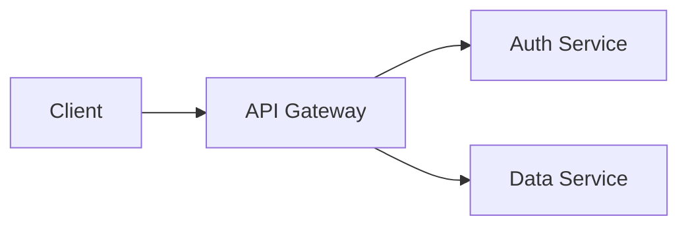

# Code Workspace Context
## Guidelines for Code Documentation Tasks

---

## Purpose

This workspace handles all code documentation tasks: API references, README files, architecture documentation, inline comments, technical guides, and developer onboarding materials.

The Code workspace applies the **Technical Laura style** by default, with additional conventions specific to software documentation.

---

## Core Principles

1. **Accuracy is non-negotiable** — Documented code must match the actual implementation
2. **Write for the reader** — Junior developers, future maintainers, and API consumers are your audience
3. **Code is truth, docs are context** — Comments explain *why*, code explains *what*
4. **Maintainability** — Documentation that rots is worse than no documentation
5. **DRY applies to docs too** — Don't repeat what the code clearly expresses

---

## Documentation Types

### 1. API Documentation
For functions, classes, modules, and endpoints.

Required elements:
- Purpose (one sentence)
- Parameters (name, type, description)
- Return value (type, description)
- Exceptions/errors raised
- Usage example

**Format:**
```markdown
## Function Name

Brief one-line description.

### Parameters
- `param1` (string): Description
- `param2` (number, optional): Description, defaults to `0`

### Returns
(type): Description of return value

### Example
```python
result = function_name("input", param2=42)
```

### Notes
Edge cases, warnings, or best practices.
```

### 2. README Files
The front door of any project or module.

Standard sections:
1. **Title and one-line description**
2. **Installation** — Prerequisites and setup steps
3. **Quick Start** — Minimal example to get running
4. **Usage** — Common tasks and patterns
5. **API Reference** — Link to detailed docs
6. **Contributing** — How to contribute (if open)
7. **License** — License information

### 3. Architecture Documentation
For system design, data flow, and high-level structure.

Include:
- System overview diagram (text or linked image)
- Component descriptions
- Data flow
- Key decisions and rationale
- Known limitations

### 4. Inline Comments
Use sparingly and strategically:

```python
# Good: Explains WHY, not WHAT
# Cache results to avoid redundant API calls
results_cache = {}

# Bad: Restates the obvious
# Create a new dictionary
results_cache = {}

# Good: Warns about non-obvious behavior
# This must run before the event loop starts
initialize_worker_pool()

# Good: Documents complex logic
# We use binary search here because the list is sorted
# and could contain up to 10M elements
```

### 5. Technical Guides
Step-by-step tutorials for specific tasks.

Structure:
1. **Goal** — What you'll accomplish
2. **Prerequisites** — What you need first
3. **Steps** — Numbered, sequential instructions
4. **Verification** — How to confirm it worked
5. **Troubleshooting** — Common problems and solutions

---

## Language-Specific Conventions

### Python
- Follow [Google style docstrings](https://google.github.io/styleguide/pyguide.html)
- Use type hints where practical
- Document exceptions with `Raises:`

### TypeScript / JavaScript
- Follow [JSDoc](https://jsdoc.app/) conventions
- Document complex types and interfaces
- Include `@example` for non-obvious functions

### Rust
- Use `///` doc comments for public APIs
- Include doc tests (`# Examples` section)
- Document `unsafe` blocks thoroughly

### Go
- Follow official [Go doc conventions](https://go.dev/blog/godoc)
- Start with the function name: "FunctionName does X..."
- Keep package docs in a `doc.go` file

---

## Code Block Standards

All code examples must be:
- **Syntactically correct** — actually parse/compile
- **Runnable** — include necessary imports/dependencies
- **Annotated** — comments explain non-obvious parts
- **Tested** — the author has verified it works

```markdown
```python
# Good example
from datetime import datetime, timedelta

def is_token_expired(token_issued_at: datetime, ttl_hours: int = 24) -> bool:
    """Check if a token has exceeded its time-to-live.
    
    Args:
        token_issued_at: When the token was created
        ttl_hours: Maximum lifetime in hours (default: 24)
        
    Returns:
        True if expired, False otherwise
    """
    expiry = token_issued_at + timedelta(hours=ttl_hours)
    return datetime.utcnow() > expiry
```
```

---

## Diagram Conventions

When architecture diagrams are needed, prefer text-based formats:

**Mermaid** (if rendering is available):


**ASCII** (universal):
```
┌─────────┐     ┌─────────────┐     ┌──────────┐
│  Client │────▶│ API Gateway │────▶│ Service  │
└─────────┘     └─────────────┘     └──────────┘
                                           │
                                           ▼
                                      ┌──────────┐
                                      │ Database │
                                      └──────────┘
```

---

## File Organization

### Projects
`workspaces/code/projects/YYYY-MM-DD_documentation-topic.md`

Examples:
- `2026-06-08_api-redesign-docs.md`
- `2026-06-08_onboarding-guide.md`

### Templates
`workspaces/code/templates/` — Reusable documentation templates
- `api-reference-template.md`
- `readme-template.md`
- `architecture-doc-template.md`

---

## Integration with Writing Workspace

Code documentation benefits from the Laura style system:
- **Technical Laura** — API docs, READMEs, architecture docs (default)
- **Neutral Laura** — Blog posts about technical topics
- **Academic Laura** — Research papers on computer science topics

When documenting code for non-technical audiences, switch to **Neutral Laura**.

---

## Memory & Learning

After completing documentation tasks:
- Update `memory/learnings.md` with technical insights
- Note successful documentation patterns
- Record common pitfalls and how to avoid them

---

**Next Action**: Based on the user's code documentation request, identify the documentation type, gather code context, and produce accurate, tested documentation.
